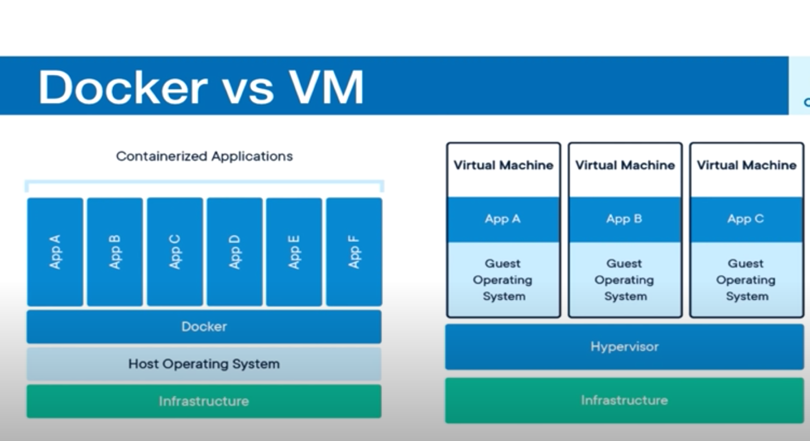

# Docker Instructions

https://hub.docker.com/editions/community/docker-ce-desktop-mac/
get docker desktop for mac
~476 mb

Docker is a tool for running Application in an isolated environment
similar to virtual machine less memory
App run in same environment
standard for software deployment,
  easy environment, just works.

## Container vs VM
containers are an abstraction at the app layer that packages code and dependencies together. Multiple containers can run on the same machine and share same OS kernel with other containers. Each running as isolated process in user space

## Virtual Machines
VM are abstraction of physical hardware turning one server into many servers. The hypervisor allows multible VMs to run on a single machine. Each VM includes a full copy of an operating system, the application, necessary binaries and libraries, taking up tens of GBs. VMs can be slow to boot

