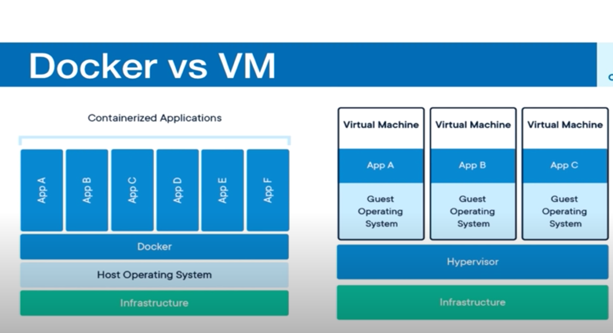

Youtube videos
https://www.youtube.com/watch?v=bhBSlnQcq2k

go this website and install, click, get docker desktop for Mac (stable version)
>https://hub.docker.com/editions/community/docker-ce-desktop-mac/

Docker is a tool for running Application in an isolated environment
similar to virtual machine less memory
App run in same environment
standard for software deployment,
  easy environment, just works.

## Container vs VM
containers are an abstraction at the app layer that packages code and dependencies together. Multiple containers can run on the same machine and share same OS kernel with other containers. Each running as isolated process in user space

## Virtual Machines
VM are abstraction of physical hardware turning one server into many servers. The hypervisor allows multible VMs to run on a single machine. Each VM includes a full copy of an operating system, the application, necessary binaries and libraries, taking up tens of GBs. VMs can be slow to boot



Benefits...
run container in seconds
less disk and memory space..
does not need full OS
deployment
testing
work

docker toolbox is previous version
docker desktop is new version.

after installation
run in terminal will show help and options

> docker

> docker --version

kill the docker in Desktop
in terminal

> docker ps
if it si running it gives contatiner id etc
says cannot connect to the docker daemon

## Docker Image
image is a templete for creating an environment of choice
snapshot
has everything need to run your apps
OS, software, App code

Running instance of an Image
image -> run container

docker hub is a registery

> docker pull nginx
Downloaded newer image for nginx:latest
latest is tag

to check docker images
> docker images


## Containers

Container is running instance of an image

to run write the name of container and its tag
> docker run nginx:latest

it is running
in new terminal, check
```
> docker container ls
```
|--|--|--|-|-|-|-|-|
| CONTAINER ID | IMAGE |COMMAND |CREATED |STATUS |PORTS | NAMES |
| 5251ca9f12eb | nginx:latest | "/docker-entrypoint.…" | About a minute ago |Up About a minute | 80/tcp | vibrant_aryabhata |
| 404f8f5aaafd | docker101tutorial |"/docker-entrypoint.…"|   2 hours ago| Up 2 hours| 0.0.0.0:80->80/tcp | docker-tutorial |
|--|--|--|-|-|-|-|-|

### run container
runs in detached mode
```
docker run -d nginx:latest
```

### status container
gives an id and no need to hanging
instead
```
docker ps (only running)
docker ps -a (shows all container not running)
docker ps -aq (get all container ids)
```
do the same job but much faster

### stop container
stop only stops it is running it is not removing
```
docker stop (containerID)
docker stop (name)
```


### running container on local host
```
docker run -d -p 8080:80 nginx:latest
```
from container to local host
```
docker run -d -p 3000:80 -p 8080:80 nginx:latest
```

### help
```
docker ps -- help
```

### delete container
```
docker rm (name or id)
docker rm $(docker ps -aq)  doesn't work if a container is running
docker rm -f $(docker ps -aq) force to kill process
```

### giving a name
```
docker run --name website -d -p 3000:80 -p 8080:80 nginx:latest
```

### format
```
 "ID\t{{.ID}}\nName\t{{.Names}}\nImage\t{{.Image}}\nPorts\t{{.Ports}}\nCommand\t{{.Command}}\nCreated\t{{.CreatedAt}}\nStatus\t{{.Status}}\n”
```

## Volumes
